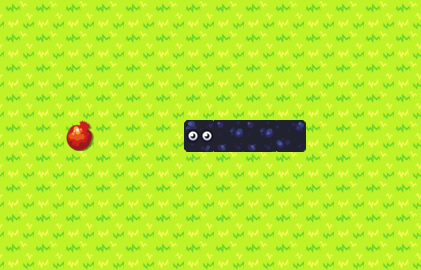

# snake-game-python

🐍 Jogo da Cobrinha em Python

---

💿 Como rodar:

- Instale a biblioteca Pygame CE

```
pip install pygame-ce
```

- Rode o <strong>main.py</strong>

```
python ./src/main.py
```



💻 Tecnologias:
- Python 3
- Pygame Community Edition

📄 Licença MIT

Por <strong>Eryk Fernandes</strong>

---